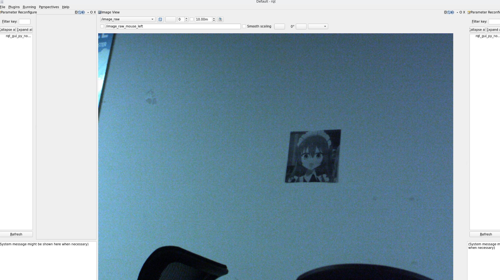
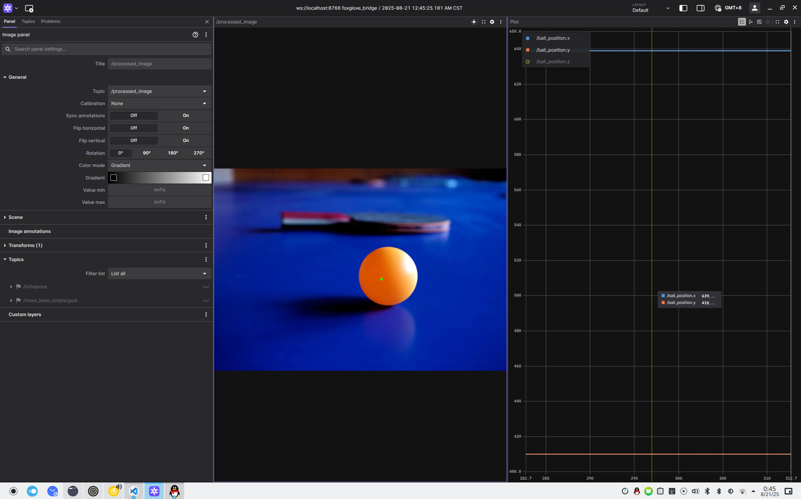

# pingpong_tracker
这是一个基于 ROS 2 Humble 的计算机视觉项目，旨在利用 MindVision 工业相机实时追踪乒乓球的位置。该项目以 docker container 形式提供，旨在为开发者提供一个即开即用、完全可复现的开发环境

Continuously updating...

## 目录
- [项目结构](#项目结构)
- [快速开始](#快速开始)
- [工作流程](#工作流程)
- [许可证](#许可证)

## 项目结构
```
pingpong_tracker_ws/
├── build/                 # 由colcon自动生成
├── install/               # 由colcon自动生成
├── log/                   # 由ROS 2自动生成
└── src/
    ├── ros2_mindvision_camera/       
    │
    ├── kalman_trajectory_predictor/
        ├── include/kalman_trajectory_predictor/
        │   ├── ball_detector.hpp             // 核心模块1: 图像处理头文件
        │   ├── kalman_filter.hpp             // 核心模块2: 卡尔曼滤波头文件
        │   ├── coordinate_converter.hpp      // 核心模块3: 坐标转换头文件
        │   ├── pnp_solver.hpp                // 核心模块4: PnP求解头文件
        │   └── image_publisher_node.hpp 
        ├── src/
        │   ├── lib/
        │   │   ├── ball_detector.cpp         // 模块1实现
        │   │   ├── kalman_filter.cpp         // 模块2实现
        │   │   ├── coordinate_converter.cpp  // 模块3实现
        │   │   └── pnp_solver.cpp            // 模块4实现
        │   ├── ball_detector_node.cpp        // ROS2 节点1: 图像处理节点
        │   ├── kalman_predictor_node.cpp     // ROS2 节点2: 卡尔曼预测节点
        │   ├── image_visualizer_node.cpp     // ROS2 节点3: 可视化节点
        │   └── image_publisher_node.cpp
        ├── launch/
        │   └── predictor.launch.py           // 启动文件
        ├── CMakeLists.txt                    // 项目构建配置
        └── package.xml                       // 项目元数据和依赖
```
## 快速开始

### 前置条件
- x86-64 架构
- 任意 Linux 发行版
- 安装 Git,Docker,Visual Studio Code
TODO

### Step 1：克隆并打开仓库
克隆仓库，注意需要使用 `recurse-submodules` 以克隆子模块：

```
#克隆本仓库,初次克隆会自动克隆子模块
git clone https://github.com/heyeuu/pingpong_tracker.git
#克隆子模块
git clone --recurse-submodules https://github.com/heyeuu/pingpong_tracker.git
```
在VSCode中打开仓库:
```
code ./pingpong_tracker
```
### Step 1：获取镜像并进入容器
#### method one:
可自行使用 `Dockerfile` 构建，参见 [镜像构建指南](docs/zh-cn/build_docker_image.md),按 `Ctrl+Shift+P`，在弹出的菜单中选择 `Dev Containers: Reopen in Container`。

#### method two:
按 `Ctrl+Shift+P`，在弹出的菜单中选择 `Dev Containers: Rebuild and reopen in Container`

VSCode 将拉起一个 `Docker` 容器，容器中已配置好完整开发环境，之后所有工作将在容器内进行。

如果 `Dev Containers` 在启动时卡住很长一段时间，可以尝试 [这个解决方案](docs/zh-cn/fix_devcontainer_stuck.md)。

### Step 3：配置 VSCode

在 VSCode 中新建终端，输入：

```bash
cp .vscode/settings.default.json .vscode/settings.json
```

这会应用我们推荐的 VSCode 配置文件，你也可以按需自行修改配置文件。

在拓展列表中，可以看到我们推荐使用的拓展正在安装，你也可以按需自行删减拓展。

### Step 4：构建

你可以在终端中输入
```
./.scripts/脚本的名称
(e.g.build.sh)
```
（TODO，好像没有很优雅）

也可以手动运行`./.scripts/build-pingpong.sh`脚本，将在路径 `pingpong_tracker_ws` 下开始构建代码。
```
./.scripts/build-pingpong.sh
```
构建完毕后，基于 `clangd` 的 `C++` 代码提示将可用。此时可以正常编写代码。

### Step 5 ：运行

编写代码并编译完成后，可以使用：

```zsh
launch.sh
```
运行     （好像不优雅）TODO


发布静态测试图片
```
ros2 run kalman_trajectory_predictor image_publisher_node
```
预测轨迹
```
ros2 run kalman_trajectory_predictor predictor_node
```
#### 确认设备接入

可以使用 `lsusb`  确定相机是否已接入，若已接入，则 `lsusb` 输出类似：

```
Bus 004 Device 004: ID f622:0001 MindVision SUA133GC
```

在<span style="color:red; background-color:#FFFF00; font-weight:bold">本机 </span>输入以下命令来确保你可以从容器中访问usb设备:
```
echo 'SUBSYSTEM=="usb", ATTR{idVendor}=="f622", ATTR{idProduct}=="0001", MODE="0666", GROUP="plugdev"' | sudo tee /etc/udev/rules.d/95-mindvision.rules && 
sudo udevadm control --reload-rules && sudo udevadm trigger
```
TODOTODOTODO

##标定方法
###单目
运行相机节点后再开一个终端运行camera_calibration节点,在终端中输入:
```
source pingpong_tracker_ws/install/setup.zsh
ros2 launch mindvision_camera mv_launch.py

ros2 run <your_camera_package> <your_camera_node>
(e.g.)
ros2 run camera_calibration cameracalibrator --ros-args --remap image:=/image_raw -- --size 7x5 --square 0.03

```
###双目
TODO

```
source pingpong_tracker_ws/install/setup.zsh
ros2 launch mindvision_camera mv_launch.py

ros2 run camera_calibration cameracalibrator --ros-args --remap left:=/my_stereo/left/image_raw --remap right:=/my_stereo/right/image_raw -- --size <NxM> --square <size_in_meters>

```
#### you can 使用foxglove来可视化你的话题
```
ros2 launch foxglove_bridge foxglove_bridge_launch.xml 
```
## 目前实现的功能
1. 相机驱动与图像发布
- 实现相机设备的驱动功能
- 通过ROS topic实时发布图像数据流


2. 快速原型开发
- 乒乓球识别：实现静态图像中乒乓球的检测与识别
- 卡尔曼滤波：应用卡尔曼滤波算法进行轨迹预测
- 流程验证：建立完整的识别-跟踪-预测处理流程


## TODO LIST

- [x] 快速原型测试
- [ ] 重构这一坨代码(持续进行)
- [ ] ros环境导入自动化
- [ ] 整理dockerfile，在一个base image的上构建develop image 和 deploy image，并筛选移除多余依赖

---

## 许可证
本项目使用 **MIT 许可证**。请查看 [LICENSE](LICENSE) 文件了解更多详情。