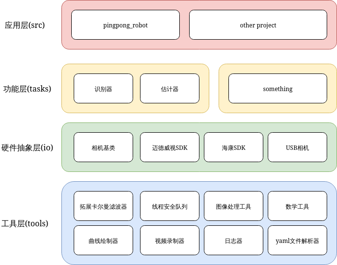

# pingpong_tracker
这是一个**无ROS依赖**的计算机视觉项目(可兼容ros2(TODO))，旨在利用 usb相机/MindVision/海康工业相机实时追踪和预测乒乓球的轨迹。该项目提供 docker container和开发环境配置脚本，旨在为开发者提供一个即开即用、完全可复现的开发环境.

Continuously updating...

## 目录

- [软件架构](#软件架构)
- [项目结构](#项目结构)
- [快速开始](#快速开始)
  - [前置条件](#前置条件)
  - [Step 1：获取镜像并进入容器](#step-1获取镜像并进入容器)
  - [Step 3：配置 VSCode](#step-3配置-vscode)
  - [Step 4：构建](#step-4构建)
  - [Step 5 ：运行](#step-5-运行)
    - [确认设备接入](#确认设备接入)
    <!-- - [使用 Foxglove 可视化](#使用-foxglove-可视化) -->
- [亮点](#亮点)
- [目前实现的功能](#目前实现的功能)
- [TODO LIST](#todo-list)
- [未来可能需要优化的](#未来可能需要优化的)
- [log](#log)
- [许可证](#许可证)

## 软件架构


<p align="center">软件架构</p>

## 项目结构

```
PINGPONG_TRACKER
├── .devcontainer/           # Dev container configuration
├── .scripts/                # Custom scripts 
├── .vscode/                 # VS Code workspace settings
├── docs/                    # Documentation files
├── pingpong_tracker_ws/    # Workspace root
│   ├── calibration/         # Calibration data or routines
│   ├── configs/             # Configuration files (e.g., YAML)
│   ├── io/                  # hardware abstraction layer
│   └── src/                 # Core source code
├── tasks/
│   └── pingpong/            # Specific task module
│       ├── CMakeLists.txt   # Task-specific build config
│       ├── identifer/
│       ├── predictor/
│       └── TODO
├── src/
│   └── TODO
├── .gitignore               # Git ignore rules
├── .gitmodules              # Git submodule definitions
├── CMakeLists.txt           # Root build configuration
├── clang-format             # Code formatting rules
├── clang-tidy               # Static analysis configuration
├── LICENSE                  # Project license
└── README.md                # Project overview and instructions

```
## 快速开始

### 前置条件
- x86-64 架构
- 任意 Linux 发行版
TODO

### Step 1：获取镜像并进入容器
#### method one:
可自行使用 `Dockerfile` 构建，参见 [镜像构建指南](docs/zh-cn/build_docker_image.md),按 `Ctrl+Shift+P`，在弹出的菜单中选择 `Dev Containers: Reopen in Container`。

#### method two:
按 `Ctrl+Shift+P`，在弹出的菜单中选择 `Dev Containers: Rebuild and reopen in Container`

VSCode 将拉起一个 `Docker` 容器，容器中已配置好完整开发环境，之后所有工作将在容器内进行。

如果 `Dev Containers` 在启动时卡住很长一段时间，可以尝试 [这个解决方案](docs/zh-cn/fix_devcontainer_stuck.md)。

### Step 3：配置 VSCode

在 VSCode 中新建终端，输入：

```bash
cp .vscode/settings.default.json .vscode/settings.json
```

这会应用我们推荐的 VSCode 配置文件，你也可以按需自行修改配置文件。

在拓展列表中，可以看到我们推荐使用的拓展正在安装，你也可以按需自行删减拓展。

### Step 4：构建
在`/workspaces/pingpong_tracker/pingpong_tracker_ws`下在终端中输入
```
cmake -B build
make -C build/ -j`nproc`
```

### Step 5 ：运行

TODO

#### 确认设备接入

可以使用 `lsusb`  确定相机是否已接入，若已接入，则 `lsusb` 输出类似：

```
Bus 004 Device 004: ID f622:0001 MindVision SUA133GC
```

在<span style="color:red; background-color:#FFFF00; font-weight:bold">本机 </span>输入以下命令来确保你可以从容器中访问usb设备:
```
echo 'SUBSYSTEM=="usb", ATTR{idVendor}=="f622", ATTR{idProduct}=="0001", MODE="0666", GROUP="plugdev"' | sudo tee /etc/udev/rules.d/95-mindvision.rules && 
sudo udevadm control --reload-rules && sudo udevadm trigger
```

<!-- #### you can 使用foxglove来可视化你的话题
```
ros2 launch foxglove_bridge foxglove_bridge_launch.xml 
``` -->
## 亮点
统一接口设计:这使得 io::Camera 可以通过多态或组合统一调用，无需关心具体设备类型

异步采集+守护线程 : safe

配置驱动:所有参数（如曝光、增益、分辨率）都从 YAML 文件加载，便于灵活调整和部署

```
┌────────────────────────────┐
│        io::Camera          │  ← 应用层统一入口
│ ────────────────────────── │
│ + read(img, timestamp)     │
│                            │
│ ┌────────────────────────┐ │
│ │ std::unique_ptr<...>   │ │
│ │ camera_                │ │
│ └────────────────────────┘ │
└────────────┬──────────────┘
             │
     ┌───────┼────────────┬────────────┐
     │       │            │            │
┌────────┐ ┌────────────┐ ┌──────────┐ ┌──────────────┐
│ USB    │ │ MindVision │ │ HikRobot │ │ SimCamera?   │
│ Camera │ │ Camera     │ │ Camera   │ │ (可扩展)     │
└────────┘ └────────────┘ └──────────┘ └──────────────┘


```
## 目前实现的功能

- 模块化摄像头读取接口 
- 实时帧率计算与日志输出  
- 可选图像显示窗口  
- 优雅退出机制  
- 命令行参数解析支持  

## TODO LIST

- [ ] 移除多余的依赖
- [ ] 修改calibration/split_video 中帧与姿态数据的对应（可用于从长视频中获得关键片段用于训练、标注或分析）
- [ ] 编写和完善tasks/
- [ ] 编写和完善test/,并测试
- [ ] 部署CI/CD，使得开发更加自动化
- [ ] 性能优化

---

## 未来可能需要优化的：
- [ ] 手眼标定（用于视觉与运动系统协同）
- [ ] 多线程并行推理
- [ ] MPC轨迹优化
- [ ] 找到cqq说的什么推流   看看怎么个事  然后拿来用来提高图像传输效率
## log
重构中...

## 许可证
本项目使用 **MIT 许可证**。请查看 [LICENSE](LICENSE) 文件了解更多详情。